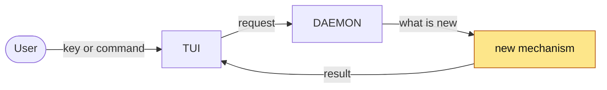

<!-- 01 · Benefit groups — the default. A feature PR with two to four things the user gets.
     Sections are named for the benefit, fixes file under the promise they keep. -->

<One or two sentences: what landed and why — the two things a reader must know before the diff.>

**Contents**
- [✨ What you get](#user-content-what-you-get)
  - [🚀 <Benefit group one>](#user-content-benefit-group-one)
  - [🔔 <Benefit group two>](#user-content-benefit-group-two)
- [📸 Screenshots](#user-content-screenshots)
- [🧭 How it flows](#user-content-how-it-flows)
- [⚠️ Risk](#user-content-risk)
- [🔧 Technical overview](#user-content-technical-overview)
- [📝 Notes](#user-content-notes)

## ✨ What you get 

### 🚀 <Benefit group one> 

- **<Two-to-five-word hook>** — <the key, command or setting it hangs on: backticks, or the `Settings › Sessions › done_sound` form>
  - <one fact: what it does>
  - <one fact: what you see>
  - <one fact: the edge — a refusal, offline, the old way>
- **<Hook>** — <…>
  - <…>
  - <…>

### 🔔 <Benefit group two> 

- **<Hook>** — <…>
  - <…>
- **<A fix, filed here because this is the promise it keeps>** — <the symptom>
  - <the cause, one clause>
  - <the new behaviour>

<!-- A group with one bullet merges into its neighbour. Two or three bullets per group. -->

## 📸 Screenshots 

| <What this shows — the screen after the change> |
|---|
|  |

<!-- Captured with the SCREENSHOT HARNESS at 190x50; hosted on the pr-assets branch (skill step 4). -->

## 🧭 How it flows 

<!-- Draw the change, not the system: ten to twenty nodes, the new node(s) given the `changed` class. -->

## ⚠️ Risk 

<!-- Only when the change ADDS A SURFACE — the DAEMON execs a program, opens a socket, route or
     ClientRequest, reads a new config source, writes a file it did not before. One bullet per way
     in: who or what reaches it, what holds it, what does not. The 🔒 row below then rates the
     residue. A PR that adds no surface deletes this subsection. -->
### 🎯 Attack surface 

- **<Way in>.** <Who or what reaches it. Held by: <mitigation>. Not held: <what remains>.>
- **<Way in>.** <…>

**Verdict:** <🟢 Low risk · 🟡 Merge with care · 🔴 Do not merge as-is — pick one, then one clause saying why. The author's own read; the PR REVIEWER SKILL checks it against the diff.>

| | Level | Why |
|---|---|---|
| 🔒 **Security & production** | <Low / Medium / High> | <who can reach the new code and what it reaches — a new `ClientRequest`, a hook route, a shell call, a token, a file the DAEMON writes — or "no new surface: <why>"> |
| ⚡ **Performance** | <Low / Medium / High> | <the hot path touched — the TUI draw, the event-loop drain, the PTY byte path, the WORKTREE SYNC tick — or "off every hot path: <why>"> |
| 🧩 **Fit with the codebase** | <Low / Medium / High> | <the existing pattern it follows, or the departure and why> |

**Rollback:** <one line — `git revert <merge>`, plus what the revert does not undo: a PROTOCOL VERSION bump, a migrated store, a pushed branch.>

## 🔧 Technical overview 

- **Mechanism.** <How it works, in three or four sentences: the type or flag added, who owns the state, what triggers it.>
- **Files.** `crates/<crate>/src/<file>.rs` — <one clause>; `crates/<crate>/src/<file>.rs` — <one clause>.
- **Not done.** <The approach rejected and why, so the reviewer does not ask "why not X".>
- **Gate.** `make ci` green — fmt, clippy, <N> tests. <Or: what did not run, and why.>

## 📝 Notes 

- <Merge state: `origin/main` (vX.Y.Z) is merged in; conflicts and what they broke, or "none".>
- <Anything the user must do to upgrade — a PROTOCOL VERSION bump means `nebula kill` first.>
- Closes #<N>.

🤖 Generated with [Claude Code](https://claude.com/claude-code)

<the session link, only when the harness footer includes one — otherwise delete this line>
