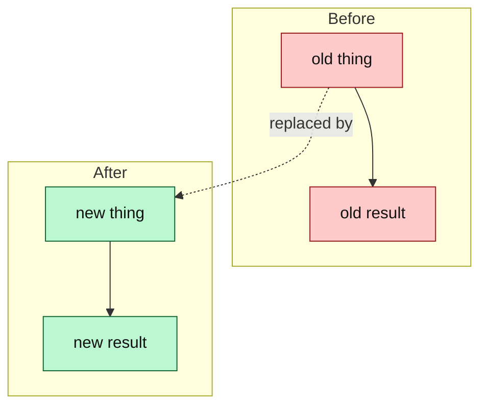

<!-- 02 · Before / After — the change replaces something visible: a layout, a key, a status colour.
     Every change is a row with both states; every screenshot is a pair. -->

<One sentence: what was replaced, and the one-clause reason.>

**Contents:** [🔁 Before / After](#user-content-before-after) · [📸 Screenshots](#user-content-screenshots) · [🧭 What moved](#user-content-what-moved) · [⚠️ Risk](#user-content-risk) · [🔧 Technical overview](#user-content-technical-overview) · [📝 Notes](#user-content-notes)

## 🔁 Before / After 

| | Before | After |
|---|---|---|
| **<Thing one>** | <what it did — one clause> | <what it does now — one clause, the key in backticks> |
| **<Thing two>** | <…> | <…> |
| **<Thing three>** | <…> | <…> |
| **Unchanged** | <what the user liked and still has — say it, so the reviewer knows you kept it> | same |

## 📸 Screenshots 

| Before | After |
|---|---|
|  |  |
|  |  |

<!-- The "before" shot comes from an origin/main build in the SCREENSHOT HARNESS; same size, same demo data, same cursor position. -->

## 🧭 What moved 

## ⚠️ Risk 

<!-- Only when the change ADDS A SURFACE — the DAEMON execs a program, opens a socket, route or
     ClientRequest, reads a new config source, writes a file it did not before. One bullet per way
     in: who or what reaches it, what holds it, what does not. The 🔒 row below then rates the
     residue. A PR that adds no surface deletes this subsection. -->
### 🎯 Attack surface 

- **<Way in>.** <Who or what reaches it. Held by: <mitigation>. Not held: <what remains>.>
- **<Way in>.** <…>

**Verdict:** <🟢 Low risk · 🟡 Merge with care · 🔴 Do not merge as-is — pick one, then one clause saying why. The author's own read; the PR REVIEWER SKILL checks it against the diff.>

| | Level | Why |
|---|---|---|
| 🔒 **Security & production** | <Low / Medium / High> | <who can reach the new code and what it reaches — a new `ClientRequest`, a hook route, a shell call, a token, a file the DAEMON writes — or "no new surface: <why>"> |
| ⚡ **Performance** | <Low / Medium / High> | <the hot path touched — the TUI draw, the event-loop drain, the PTY byte path, the WORKTREE SYNC tick — or "off every hot path: <why>"> |
| 🧩 **Fit with the codebase** | <Low / Medium / High> | <the existing pattern it follows, or the departure and why> |

**Rollback:** <one line — `git revert <merge>`, plus what the revert does not undo: a PROTOCOL VERSION bump, a migrated store, a pushed branch.>

## 🔧 Technical overview 

- **What actually changed.** <The mechanism in three sentences; name the type, the flag, the function that moved.>
- **Files.** `crates/<crate>/src/<file>.rs` — <clause>; `crates/<crate>/src/<file>.rs` — <clause>.
- **Kept as-is on purpose.** <The behaviour the change stops short of, and why.>
- **Gate.** <`make ci` green — N tests; or what did not run and why.>

## 📝 Notes 

- <Merge state and conflicts.>
- <Upgrade note, if any.>

🤖 Generated with [Claude Code](https://claude.com/claude-code)

<the session link, only when the harness footer includes one — otherwise delete this line>
