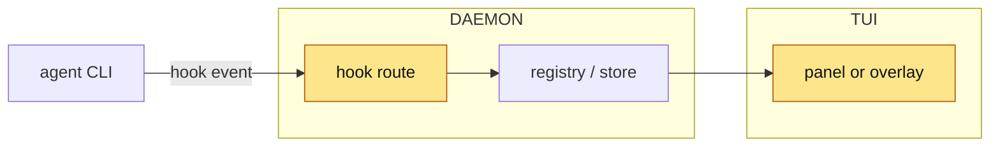

<!-- 03 · Category table — a mixed branch: features, fixes, docs, tests, refactors in one PR.
     The table at the top is the whole PR at a glance; each category section expands one row group. -->

<One or two sentences: the theme that ties the branch together, and the headline item.>

**Contents:** [📋 At a glance](#user-content-at-a-glance) · [✨ Features](#user-content-features) · [🐛 Fixes](#user-content-fixes) · [📝 Docs](#user-content-docs) · [🧪 Tests](#user-content-tests) · [📸 Screenshots](#user-content-screenshots) · [🧭 Diagram](#user-content-diagram) · [⚠️ Risk](#user-content-risk) · [🔧 Technical overview](#user-content-technical-overview) · [📓 Notes](#user-content-notes)

## 📋 At a glance 

| | Category | Change | Where it shows |
|---|---|---|---|
| ✨ | Feature | **<hook>** — <one clause> | <panel, key or command> |
| ✨ | Feature | **<hook>** — <one clause> | <…> |
| 🐛 | Fix | **<hook>** — <symptom → now> | <…> |
| 📝 | Docs | **<hook>** — <what page changed> | `docs/<page>.md` |
| 🧪 | Tests | **<hook>** — <what is now covered> | `crates/<crate>/tests/<file>.rs` |
| ♻ | Refactor | **<hook>** — <no behaviour change; what moved> | `crates/<crate>/src/` |

## ✨ Features 

- **<Hook>.** <Two or three sentences for someone who has not read the diff: key or command in backticks, the setting path, where it lives.>
- **<Hook>.** <…>

## 🐛 Fixes 

- **<Hook>.** <The cause in one clause, the new behaviour in the next.> Fixes #<N>.

## 📝 Docs 

- **<Hook>.** <Which of the DOCS PAGES, and what claim it now makes.>

## 🧪 Tests 

- **<Hook>.** <What the new test proves; where it would have caught the old bug.>

## 📸 Screenshots 

| ✨ <Feature one> | 🐛 <Fix, after> |
|---|---|
|  |  |

## 🧭 Diagram 

## ⚠️ Risk 

<!-- Only when the change ADDS A SURFACE — the DAEMON execs a program, opens a socket, route or
     ClientRequest, reads a new config source, writes a file it did not before. One bullet per way
     in: who or what reaches it, what holds it, what does not. The 🔒 row below then rates the
     residue. A PR that adds no surface deletes this subsection. -->
### 🎯 Attack surface 

- **<Way in>.** <Who or what reaches it. Held by: <mitigation>. Not held: <what remains>.>
- **<Way in>.** <…>

**Verdict:** <🟢 Low risk · 🟡 Merge with care · 🔴 Do not merge as-is — pick one, then one clause saying why. The author's own read; the PR REVIEWER SKILL checks it against the diff.>

| | Level | Why |
|---|---|---|
| 🔒 **Security & production** | <Low / Medium / High> | <who can reach the new code and what it reaches — a new `ClientRequest`, a hook route, a shell call, a token, a file the DAEMON writes — or "no new surface: <why>"> |
| ⚡ **Performance** | <Low / Medium / High> | <the hot path touched — the TUI draw, the event-loop drain, the PTY byte path, the WORKTREE SYNC tick — or "off every hot path: <why>"> |
| 🧩 **Fit with the codebase** | <Low / Medium / High> | <the existing pattern it follows, or the departure and why> |

**Rollback:** <one line — `git revert <merge>`, plus what the revert does not undo: a PROTOCOL VERSION bump, a migrated store, a pushed branch.>

## 🔧 Technical overview 

- **Features.** <Mechanism, three sentences; files with a clause each.>
- **Fixes.** <Root cause and the one-line change; the regression test's name.>
- **Refactor.** <What moved where, and the proof nothing changed (same test count, a diff of the rendered output).>
- **Gate.** <`make ci` green — N tests; or what did not run and why.>

## 📓 Notes 

- <Merge state, conflicts, upgrade note.>

🤖 Generated with [Claude Code](https://claude.com/claude-code)

<the session link, only when the harness footer includes one — otherwise delete this line>
