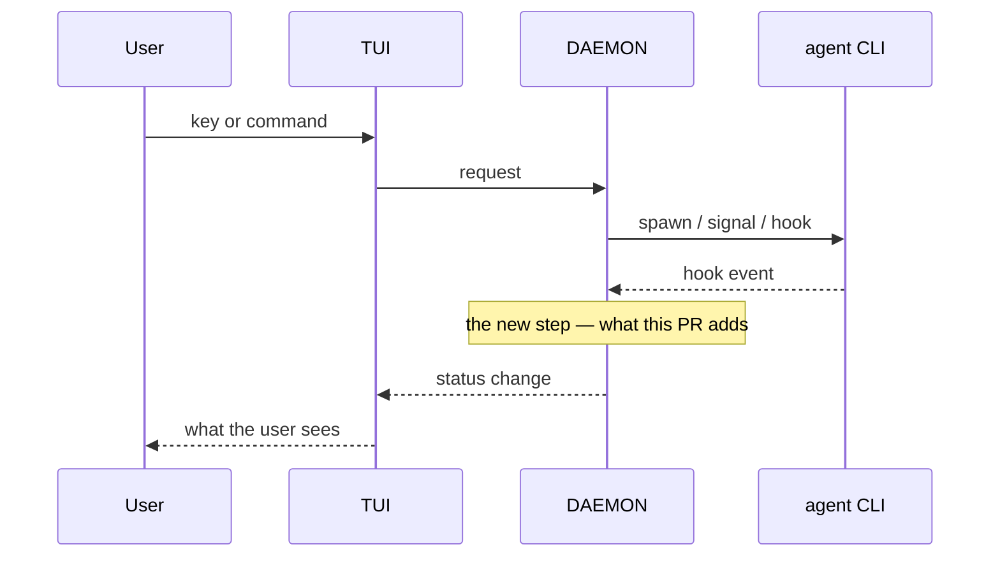

<!-- 04 · Story — one change with a strong why. Numbered sections read top to bottom:
     problem → change → how it looks → how it works → risk → the details → notes. -->

<One sentence that names the problem and the fix together: "X made Y happen; now Z."> 

**Contents:** [1. The problem](#user-content-1-the-problem) · [2. What changed](#user-content-2-what-changed) · [3. How it looks](#user-content-3-how-it-looks) · [4. How it works](#user-content-4-how-it-works) · [5. Risk](#user-content-5-risk) · [6. Technical overview](#user-content-6-technical-overview) · [7. Notes](#user-content-7-notes)

## 1. The problem 

<Two to four sentences, in the user's words where possible: what they saw, when, why it mattered. No code yet.>

> <Optional: the user's own sentence, quoted.>

## 2. What changed 

- **<Hook>.** <The new behaviour, the key or command in backticks.>
- **<Hook>.** <…>
- **Unchanged.** <What the user liked and still has.>

## 3. How it looks 

| <Caption: what this shows> |
|---|
|  |

<!-- A before shot too, if the problem was visible: make it a two-column table. -->

## 4. How it works 

## 5. Risk 

<!-- Only when the change ADDS A SURFACE — the DAEMON execs a program, opens a socket, route or
     ClientRequest, reads a new config source, writes a file it did not before. One bullet per way
     in: who or what reaches it, what holds it, what does not. The 🔒 row below then rates the
     residue. A PR that adds no surface deletes this subsection. -->
### 🎯 Attack surface 

- **<Way in>.** <Who or what reaches it. Held by: <mitigation>. Not held: <what remains>.>
- **<Way in>.** <…>

**Verdict:** <🟢 Low risk · 🟡 Merge with care · 🔴 Do not merge as-is — pick one, then one clause saying why. The author's own read; the PR REVIEWER SKILL checks it against the diff.>

| | Level | Why |
|---|---|---|
| 🔒 **Security & production** | <Low / Medium / High> | <who can reach the new code and what it reaches — a new `ClientRequest`, a hook route, a shell call, a token, a file the DAEMON writes — or "no new surface: <why>"> |
| ⚡ **Performance** | <Low / Medium / High> | <the hot path touched — the TUI draw, the event-loop drain, the PTY byte path, the WORKTREE SYNC tick — or "off every hot path: <why>"> |
| 🧩 **Fit with the codebase** | <Low / Medium / High> | <the existing pattern it follows, or the departure and why> |

**Rollback:** <one line — `git revert <merge>`, plus what the revert does not undo: a PROTOCOL VERSION bump, a migrated store, a pushed branch.>

## 6. Technical overview 

- **Mechanism.** <Three or four sentences: the type or flag, who owns the state, what triggers it.>
- **Files.** `crates/<crate>/src/<file>.rs` — <clause>; `crates/<crate>/src/<file>.rs` — <clause>.
- **Why not <the obvious alternative>.** <One or two sentences.>
- **Gate.** <`make ci` green — N tests; or what did not run and why.>

## 7. Notes 

- <Merge state, conflicts, upgrade note.>
- Closes #<N>.

🤖 Generated with [Claude Code](https://claude.com/claude-code)

<the session link, only when the harness footer includes one — otherwise delete this line>
