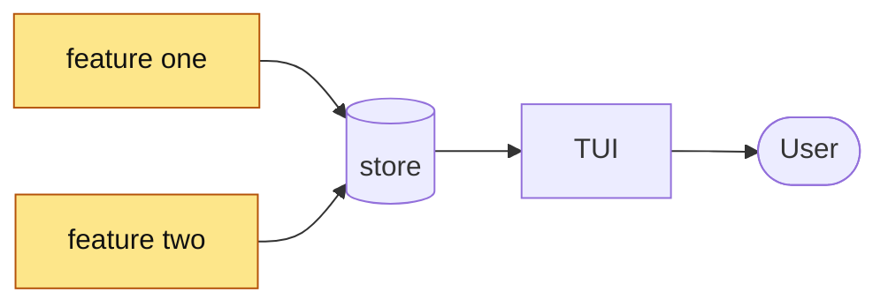

<!-- 05 · Release note — the PR is most of a release. The groups mirror the GitHub RELEASE NOTES,
     so the changelog can be lifted from the body when the tag is cut. -->

**This PR:** <the release in half a sentence, naming the headline items in the order the groups use.>

**Contents:** [🎁 Highlights](#user-content-highlights) · [🚧 Heads up](#user-content-heads-up) · [📸 Screenshots](#user-content-screenshots) · [🧭 Diagram](#user-content-diagram) · [⚠️ Risk](#user-content-risk) · [🔧 Technical overview](#user-content-technical-overview) · [📝 Notes](#user-content-notes)

## 🎁 Highlights 

### 🚀 <Benefit group — e.g. Launch faster>

- **<Hook>.** <Two or three sentences: key or command in backticks, the setting path, where it lives.>
- **<Hook>.** <…>

### 🔔 <Benefit group — e.g. Know when it's done>

- **<Hook>.** <…>
- **<A fix under the promise it keeps>.** <Cause in one clause, new behaviour in the next.>

### 🧭 <Benefit group — e.g. Lists that look after themselves>

- **<Hook>.** <…>

<!-- Reuse the release notes' group names when they fit: 🚀 Launch faster · 🔔 Know when it's done ·
     🧭 Lists that look after themselves · 🫥 Shape the screen · 🔌 Reach it from anywhere. -->

## 🚧 Heads up 

<What the user must do to upgrade, one line: a PROTOCOL VERSION bump means `nebula kill` on the old daemon before the new TUI attaches. Delete the section when nothing needs them.>

## 📸 Screenshots 

| 🚀 <group one> | 🔔 <group two> |
|---|---|
|  |  |

## 🧭 Diagram 

## ⚠️ Risk 

<!-- Only when the change ADDS A SURFACE — the DAEMON execs a program, opens a socket, route or
     ClientRequest, reads a new config source, writes a file it did not before. One bullet per way
     in: who or what reaches it, what holds it, what does not. The 🔒 row below then rates the
     residue. A PR that adds no surface deletes this subsection. -->
### 🎯 Attack surface 

- **<Way in>.** <Who or what reaches it. Held by: <mitigation>. Not held: <what remains>.>
- **<Way in>.** <…>

**Verdict:** <🟢 Low risk · 🟡 Merge with care · 🔴 Do not merge as-is — pick one, then one clause saying why. The author's own read; the PR REVIEWER SKILL checks it against the diff.>

| | Level | Why |
|---|---|---|
| 🔒 **Security & production** | <Low / Medium / High> | <who can reach the new code and what it reaches — a new `ClientRequest`, a hook route, a shell call, a token, a file the DAEMON writes — or "no new surface: <why>"> |
| ⚡ **Performance** | <Low / Medium / High> | <the hot path touched — the TUI draw, the event-loop drain, the PTY byte path, the WORKTREE SYNC tick — or "off every hot path: <why>"> |
| 🧩 **Fit with the codebase** | <Low / Medium / High> | <the existing pattern it follows, or the departure and why> |

**Rollback:** <one line — `git revert <merge>`, plus what the revert does not undo: a PROTOCOL VERSION bump, a migrated store, a pushed branch.>

## 🔧 Technical overview 

- **<Group one>.** <Mechanism in three sentences; files with a clause each.>
- **<Group two>.** <…>
- **Protocol.** <PROTOCOL VERSION N → N+1 because <field added>; or "unchanged".>
- **Gate.** <`make ci` green — N tests; or what did not run and why.>

## 📝 Notes 

- <Merge state, conflicts.>
- <Contributors: Thanks @handle (#NN).>

🤖 Generated with [Claude Code](https://claude.com/claude-code)

<the session link, only when the harness footer includes one — otherwise delete this line>
