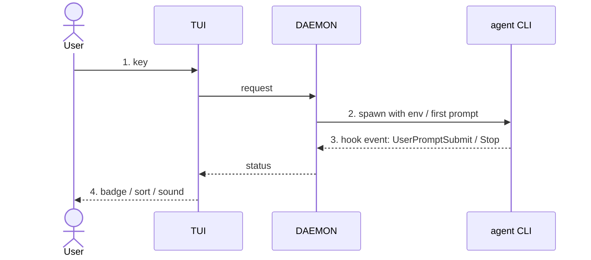

<!-- 06 · User journey — the change is a sequence of things the user does and sees.
     One numbered step per action, a screenshot per step, the diagram is the same sequence from the inside. -->

<One sentence: the journey this PR adds or changes, from the first key to the last screen.>

**Contents:** [🪜 The journey](#user-content-the-journey) · [📸 Screenshots](#user-content-screenshots) · [🧭 Under the hood](#user-content-under-the-hood) · [⚠️ Risk](#user-content-risk) · [🔧 Technical overview](#user-content-technical-overview) · [📝 Notes](#user-content-notes)

## 🪜 The journey 

1. **You press `<key>`** in the <PANEL>. <What appears, one clause.>
2. **You <type / pick / confirm>.** <What the screen does, one clause.>
3. **The <SESSION / WORKTREE / …> <starts / moves / finishes>.** <The status you see and when.>
4. **You come back later.** <What has changed on screen without you — the badge, the sort, the sound.>

**Still the same:** <the parts of the flow the user already knows that did not move.>

## 📸 Screenshots 

| Step 1 — <caption> | Step 2 — <caption> |
|---|---|
|  |  |
| **Step 3 — <caption>** | **Step 4 — <caption>** |
|  |  |

## 🧭 Under the hood 

## ⚠️ Risk 

<!-- Only when the change ADDS A SURFACE — the DAEMON execs a program, opens a socket, route or
     ClientRequest, reads a new config source, writes a file it did not before. One bullet per way
     in: who or what reaches it, what holds it, what does not. The 🔒 row below then rates the
     residue. A PR that adds no surface deletes this subsection. -->
### 🎯 Attack surface 

- **<Way in>.** <Who or what reaches it. Held by: <mitigation>. Not held: <what remains>.>
- **<Way in>.** <…>

**Verdict:** <🟢 Low risk · 🟡 Merge with care · 🔴 Do not merge as-is — pick one, then one clause saying why. The author's own read; the PR REVIEWER SKILL checks it against the diff.>

| | Level | Why |
|---|---|---|
| 🔒 **Security & production** | <Low / Medium / High> | <who can reach the new code and what it reaches — a new `ClientRequest`, a hook route, a shell call, a token, a file the DAEMON writes — or "no new surface: <why>"> |
| ⚡ **Performance** | <Low / Medium / High> | <the hot path touched — the TUI draw, the event-loop drain, the PTY byte path, the WORKTREE SYNC tick — or "off every hot path: <why>"> |
| 🧩 **Fit with the codebase** | <Low / Medium / High> | <the existing pattern it follows, or the departure and why> |

**Rollback:** <one line — `git revert <merge>`, plus what the revert does not undo: a PROTOCOL VERSION bump, a migrated store, a pushed branch.>

## 🔧 Technical overview 

- **Step 1–2.** <Mechanism: the overlay or picker, the request type, three sentences; files with a clause each.>
- **Step 3–4.** <Mechanism: the daemon-side state, the hook route, the TUI field it feeds.>
- **Files.** `crates/nebula-tui/src/<file>.rs` — <clause>; `crates/nebula-daemon/src/<file>.rs` — <clause>.
- **Gate.** <`make ci` green — N tests, including the e2e that walks this journey; or what did not run and why.>

## 📝 Notes 

- <Merge state, conflicts, upgrade note.>

🤖 Generated with [Claude Code](https://claude.com/claude-code)

<the session link, only when the harness footer includes one — otherwise delete this line>
