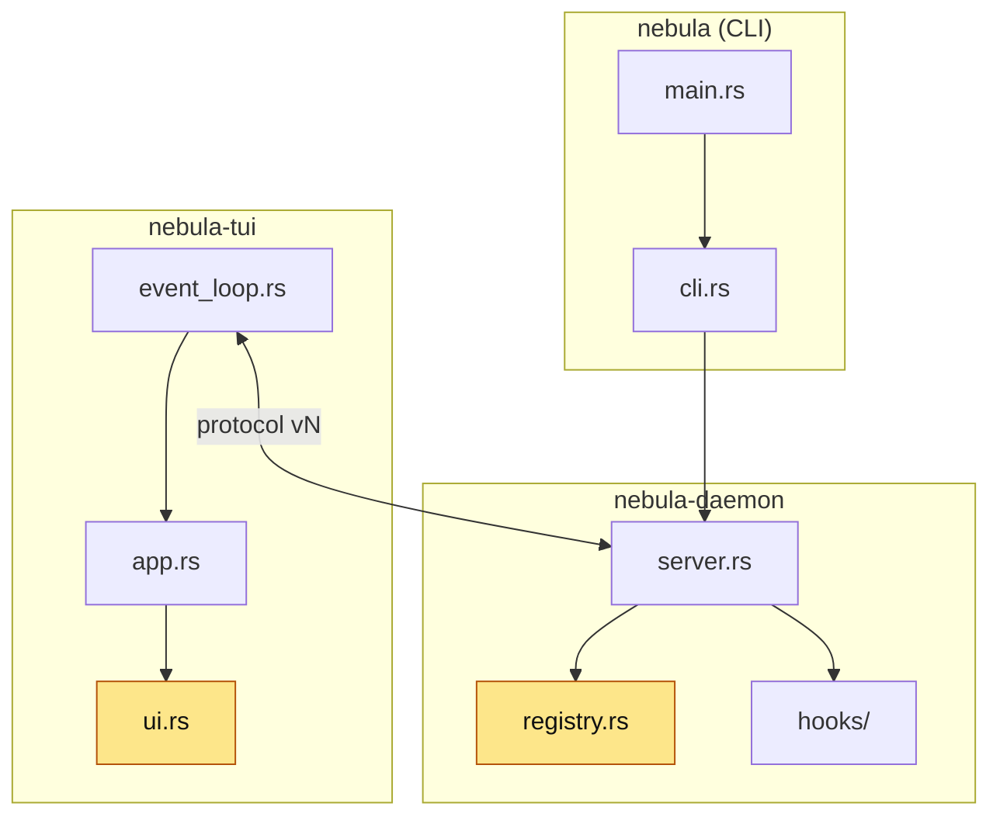

<!-- 07 · Collapsible — a big diff whose detail would bury the summary. Headings stay outside the
     
 blocks so the TOC links still resolve; only the bodies fold. -->

<Two sentences: what this PR is, and the one number that says how big (files, tests, a version).>

**Contents:** [🎯 Summary](#user-content-summary) · [✨ Changes](#user-content-changes) · [📸 Screenshots](#user-content-screenshots) · [🧩 Architecture](#user-content-architecture) · [⚠️ Risk](#user-content-risk) · [🔧 Technical overview](#user-content-technical-overview) · [📝 Notes](#user-content-notes)

## 🎯 Summary 

- **<Hook one>.** <One sentence.>
- **<Hook two>.** <One sentence.>
- **<Hook three>.** <One sentence.>

## ✨ Changes 

🚀 <b>&lt;Change one&gt;</b> — &lt;one clause&gt;

<Two or three paragraphs or bullets, still high level: the key or command in backticks, what the user sees, what stayed the same.>

🔔 <b>&lt;Change two&gt;</b> — &lt;one clause&gt;

<…>

🐛 <b>&lt;Fix&gt;</b> — &lt;symptom → now&gt;

<The cause in one clause, the new behaviour in the next.> Fixes #<N>.

<!-- A blank line after 
 and before 
 is what makes GitHub render the markdown inside. -->

## 📸 Screenshots 

| <Change one> | <Change two> |
|---|---|
|  |  |

## 🧩 Architecture 

## ⚠️ Risk 

<!-- Only when the change ADDS A SURFACE — the DAEMON execs a program, opens a socket, route or
     ClientRequest, reads a new config source, writes a file it did not before. One bullet per way
     in: who or what reaches it, what holds it, what does not. The 🔒 row below then rates the
     residue. A PR that adds no surface deletes this subsection. -->
### 🎯 Attack surface 

- **<Way in>.** <Who or what reaches it. Held by: <mitigation>. Not held: <what remains>.>
- **<Way in>.** <…>

**Verdict:** <🟢 Low risk · 🟡 Merge with care · 🔴 Do not merge as-is — pick one, then one clause saying why. The author's own read; the PR REVIEWER SKILL checks it against the diff.>

| | Level | Why |
|---|---|---|
| 🔒 **Security & production** | <Low / Medium / High> | <who can reach the new code and what it reaches — a new `ClientRequest`, a hook route, a shell call, a token, a file the DAEMON writes — or "no new surface: <why>"> |
| ⚡ **Performance** | <Low / Medium / High> | <the hot path touched — the TUI draw, the event-loop drain, the PTY byte path, the WORKTREE SYNC tick — or "off every hot path: <why>"> |
| 🧩 **Fit with the codebase** | <Low / Medium / High> | <the existing pattern it follows, or the departure and why> |

**Rollback:** <one line — `git revert <merge>`, plus what the revert does not undo: a PROTOCOL VERSION bump, a migrated store, a pushed branch.>

## 🔧 Technical overview 

Mechanism, files, rejected approaches, gate

- **Mechanism.** <Three or four sentences per change.>
- **Files.** `crates/<crate>/src/<file>.rs` — <clause>; `crates/<crate>/src/<file>.rs` — <clause>.
- **Not done.** <The approach rejected and why.>
- **Gate.** <`make ci` green — N tests; or what did not run and why.>

## 📝 Notes 

- <Merge state, conflicts, upgrade note.>

🤖 Generated with [Claude Code](https://claude.com/claude-code)

<the session link, only when the harness footer includes one — otherwise delete this line>
