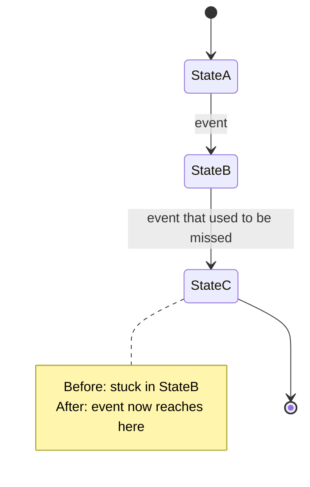

<!-- 08 · Bug fix — issue-driven. Symptom, cause, fix, proof, in that order; the pair of screenshots
     is the proof a reviewer can see without running anything. -->

Closes #<N>. <One sentence: what was wrong, and what is true now.>

**Contents:** [🐛 Symptom](#user-content-symptom) · [🔍 Cause](#user-content-cause) · [✅ Fix](#user-content-fix) · [📸 Before / After](#user-content-before-after) · [🔁 State](#user-content-state) · [⚠️ Risk](#user-content-risk) · [🔧 Technical overview](#user-content-technical-overview) · [🧪 Proof](#user-content-proof) · [📝 Notes](#user-content-notes)

## 🐛 Symptom 

<What the user saw, in their words (the issue title): the screen, the key, the terminal, the version. Two or three sentences.>

## 🔍 Cause 

<The root cause in plain words, one paragraph: which value was wrong, since when, and why nothing caught it.>

## ✅ Fix 

- **<Hook>.** <The new behaviour, one or two sentences.>
- **Unchanged.** <What around it was deliberately left alone.>

## 📸 Before / After 

| Before (#<N>) | After |
|---|---|
|  |  |

## 🔁 State 

<!-- Or a flowchart with the buggy edge in red and the fixed edge in green, when the bug is a wrong path rather than a missing transition. -->

## ⚠️ Risk 

<!-- Only when the change ADDS A SURFACE — the DAEMON execs a program, opens a socket, route or
     ClientRequest, reads a new config source, writes a file it did not before. One bullet per way
     in: who or what reaches it, what holds it, what does not. The 🔒 row below then rates the
     residue. A PR that adds no surface deletes this subsection. -->
### 🎯 Attack surface 

- **<Way in>.** <Who or what reaches it. Held by: <mitigation>. Not held: <what remains>.>
- **<Way in>.** <…>

**Verdict:** <🟢 Low risk · 🟡 Merge with care · 🔴 Do not merge as-is — pick one, then one clause saying why. The author's own read; the PR REVIEWER SKILL checks it against the diff.>

| | Level | Why |
|---|---|---|
| 🔒 **Security & production** | <Low / Medium / High> | <who can reach the new code and what it reaches — a new `ClientRequest`, a hook route, a shell call, a token, a file the DAEMON writes — or "no new surface: <why>"> |
| ⚡ **Performance** | <Low / Medium / High> | <the hot path touched — the TUI draw, the event-loop drain, the PTY byte path, the WORKTREE SYNC tick — or "off every hot path: <why>"> |
| 🧩 **Fit with the codebase** | <Low / Medium / High> | <the existing pattern it follows, or the departure and why> |

**Rollback:** <one line — `git revert <merge>`, plus what the revert does not undo: a PROTOCOL VERSION bump, a migrated store, a pushed branch.>

## 🔧 Technical overview 

- **The line that mattered.** `crates/<crate>/src/<file>.rs` — <what the old code did and what the new code does, two sentences>.
- **Why it was missed.** <The test gap or the environment difference.>
- **Why not <the obvious alternative>.** <One sentence.>

## 🧪 Proof 

- **Regression test.** `<test_name>` in `crates/<crate>/src/<file>.rs` — fails on `origin/main`, passes here.
- **Gate.** <`make ci` green — N tests; or what did not run and why.>

## 📝 Notes 

- <Merge state, conflicts, upgrade note.>

🤖 Generated with [Claude Code](https://claude.com/claude-code)

<the session link, only when the harness footer includes one — otherwise delete this line>
