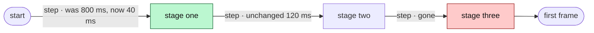

<!-- 09 · Scorecard — numbers tell the story: perf, size, test count, a protocol bump.
     Every number in the table comes from a command you ran on both sides; say which command. -->

<One sentence: what got faster, smaller or safer, with the headline number.>

**Contents:** [📊 Scorecard](#user-content-scorecard) · [✨ What changed](#user-content-what-changed) · [📸 Screenshots](#user-content-screenshots) · [🧭 Where the time goes](#user-content-where-the-time-goes) · [⚠️ Risk](#user-content-risk) · [🔧 Technical overview](#user-content-technical-overview) · [📝 Notes](#user-content-notes)

## 📊 Scorecard 

| Metric | Before | After | Δ | Measured with |
|---|---|---|---|---|
| <Startup to first frame> | <1.8 s> | <0.4 s> | **−78 %** | `<command>` |
| <Idle RSS, daemon> | <610 MB> | <90 MB> | **−85 %** | `ps -o rss` |
| Tests | <631> | <687> | +56 | `cargo test --workspace` |
| Lines (net) | | | <+846 −346> | `git diff --stat origin/main` |
| PROTOCOL VERSION | <31> | <32> | +1 | `nebula_core::protocol` |

## ✨ What changed 

- **<Hook>.** <What the user gets, one or two sentences; the key, command or setting in backticks.>
- **<Hook>.** <…>
- **Unchanged.** <What the user liked and still has.>

## 📸 Screenshots 

| <Caption: the screen after the change — or the FOOTER showing the new number> |
|---|
|  |

## 🧭 Where the time goes 

<!-- Or `pie showData` of the diff by crate when the story is where the code moved, not how long it takes. -->

## ⚠️ Risk 

<!-- Only when the change ADDS A SURFACE — the DAEMON execs a program, opens a socket, route or
     ClientRequest, reads a new config source, writes a file it did not before. One bullet per way
     in: who or what reaches it, what holds it, what does not. The 🔒 row below then rates the
     residue. A PR that adds no surface deletes this subsection. -->
### 🎯 Attack surface 

- **<Way in>.** <Who or what reaches it. Held by: <mitigation>. Not held: <what remains>.>
- **<Way in>.** <…>

**Verdict:** <🟢 Low risk · 🟡 Merge with care · 🔴 Do not merge as-is — pick one, then one clause saying why. The author's own read; the PR REVIEWER SKILL checks it against the diff.>

| | Level | Why |
|---|---|---|
| 🔒 **Security & production** | <Low / Medium / High> | <who can reach the new code and what it reaches — a new `ClientRequest`, a hook route, a shell call, a token, a file the DAEMON writes — or "no new surface: <why>"> |
| ⚡ **Performance** | <Low / Medium / High> | <the hot path touched — the TUI draw, the event-loop drain, the PTY byte path, the WORKTREE SYNC tick — or "off every hot path: <why>"> |
| 🧩 **Fit with the codebase** | <Low / Medium / High> | <the existing pattern it follows, or the departure and why> |

**Rollback:** <one line — `git revert <merge>`, plus what the revert does not undo: a PROTOCOL VERSION bump, a migrated store, a pushed branch.>

## 🔧 Technical overview 

- **Mechanism.** <Three or four sentences: what was cached, skipped, batched or moved, and who owns it now.>
- **Files.** `crates/<crate>/src/<file>.rs` — <clause>; `crates/<crate>/src/<file>.rs` — <clause>.
- **How the numbers were taken.** <Machine, build profile, the exact command, how many runs.>
- **Gate.** <`make ci` green — N tests; or what did not run and why.>

## 📝 Notes 

- <Merge state, conflicts.>
- <A PROTOCOL VERSION bump means `nebula kill` on the old daemon before the new TUI attaches.>

🤖 Generated with [Claude Code](https://claude.com/claude-code)

<the session link, only when the harness footer includes one — otherwise delete this line>
