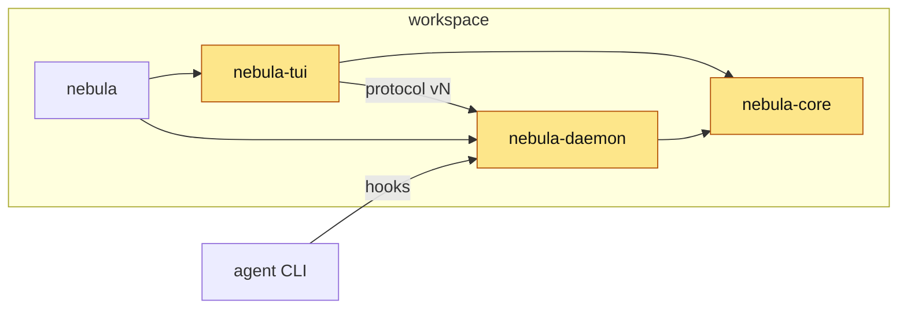

<!-- 10 · Crate map — the change spans the workspace. Organise by where it lives; the diagram is
     the workspace with the touched crates lit up. -->

<Two sentences: what landed across the workspace, and the one place a reviewer should start.>

**Contents:** [📦 By crate](#user-content-by-crate) · [🧩 Workspace map](#user-content-workspace-map) · [📸 Screenshots](#user-content-screenshots) · [⚠️ Risk](#user-content-risk) · [🔧 Technical overview](#user-content-technical-overview) · [📝 Notes](#user-content-notes)

## 📦 By crate 

### 🧱 nebula-core

- **<Hook>.** <The type, flag or protocol field, and what it means for the user, one sentence.>

### ⚙ nebula-daemon

- **<Hook>.** <What the DAEMON now does, the hook route or mechanism in backticks.>
- **<Hook>.** <…>

### 🖥 nebula-tui

- **<Hook>.** <What the user sees, the key in backticks, the panel it lives in.>

### 💻 nebula (CLI)

- **<Hook>.** <The subcommand or flag, `nebula `, and what it prints.>

### 📚 docs

- **<Hook>.** <Which of the DOCS PAGES changed.>

## 🧩 Workspace map 

<!-- Give the `changed` class to every crate the diffstat names; leave the rest plain. -->

## 📸 Screenshots 

| <Caption: what the TUI shows after the change> |
|---|
|  |

<!-- A pure daemon/core change: a fenced block of the terminal output instead, plus one line on why there is no PNG. -->

## ⚠️ Risk 

<!-- Only when the change ADDS A SURFACE — the DAEMON execs a program, opens a socket, route or
     ClientRequest, reads a new config source, writes a file it did not before. One bullet per way
     in: who or what reaches it, what holds it, what does not. The 🔒 row below then rates the
     residue. A PR that adds no surface deletes this subsection. -->
### 🎯 Attack surface 

- **<Way in>.** <Who or what reaches it. Held by: <mitigation>. Not held: <what remains>.>
- **<Way in>.** <…>

**Verdict:** <🟢 Low risk · 🟡 Merge with care · 🔴 Do not merge as-is — pick one, then one clause saying why. The author's own read; the PR REVIEWER SKILL checks it against the diff.>

| | Level | Why |
|---|---|---|
| 🔒 **Security & production** | <Low / Medium / High> | <who can reach the new code and what it reaches — a new `ClientRequest`, a hook route, a shell call, a token, a file the DAEMON writes — or "no new surface: <why>"> |
| ⚡ **Performance** | <Low / Medium / High> | <the hot path touched — the TUI draw, the event-loop drain, the PTY byte path, the WORKTREE SYNC tick — or "off every hot path: <why>"> |
| 🧩 **Fit with the codebase** | <Low / Medium / High> | <the existing pattern it follows, or the departure and why> |

**Rollback:** <one line — `git revert <merge>`, plus what the revert does not undo: a PROTOCOL VERSION bump, a migrated store, a pushed branch.>

## 🔧 Technical overview 

- **nebula-core.** `crates/nebula-core/src/<file>.rs` — <clause>. <PROTOCOL VERSION N → N+1, or "unchanged".>
- **nebula-daemon.** `crates/nebula-daemon/src/<file>.rs` — <clause>; `…/<file>.rs` — <clause>.
- **nebula-tui.** `crates/nebula-tui/src/<file>.rs` — <clause>.
- **nebula.** `crates/nebula/src/<file>.rs` — <clause>.
- **Not done.** <The approach rejected and why.>
- **Gate.** <`make ci` green — N tests; or what did not run and why.>

## 📝 Notes 

- <Merge state, conflicts.>
- <Upgrade note: `nebula kill` first when the PROTOCOL VERSION moved.>

🤖 Generated with [Claude Code](https://claude.com/claude-code)

<the session link, only when the harness footer includes one — otherwise delete this line>
